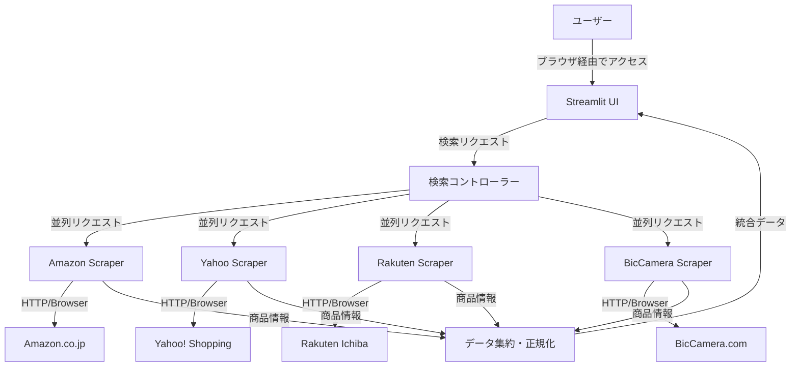

# アーキテクチャ設計 (Architecture)

## 1. システム構成図
このシステムは、Pythonを用いたローカルWebアプリケーションとして動作することを想定します。



## 2. コンポーネント詳細

### 2.1 UI / Frontend (Streamlit)
*   **役割**: 検索キーワードの入力、検索実行ボタン、結果の表示。
*   **選定理由**: PythonのみでインタラクティブなUIを構築でき、プロトタイピングから実用までが非常に速いため、個人開発（自分用）に最適。

### 2.2 Controller / Backend Logic
*   **役割**: 非同期処理（`asyncio`）を用いて各スクレイパーを並列実行し、全体の応答時間を短縮する。

### 2.3 Scrapers
*   **技術**: `Playwright` (Python版)
    *   **理由**: 最近のECサイトはJavaScriptを多用しており、単純なHTTPリクエストでは情報が取得できない場合が多い。また、Bot対策回避のためにもブラウザオートメーションが有効。
*   **各サイトの実装**:
    *   共通のインターフェース（`search(keyword) -> List[Product]`）を持つ。
    *   サイトごとのDOM構造に合わせてパース処理を実装。

### 2.4 Data Aggregator
*   **役割**: 各サイトから返ってきたデータを統一フォーマットに変換する（価格の数値化、通貨単位の統一など）。
*   **データ構造**:
    ```python
    @dataclass
    class Product:
        title: str
        price: int
        url: str
        site_name: str
        image_url: str
    ```

## 3. 開発フロー
1.  基本のプロジェクト構成作成 (`poetry` または `uv` 使用)
2.  各サイトのスクレイピングモジュールの作成と単体テスト
3.  StreamlitによるUI実装と統合
4.  動作確認とチューニング

## 4. 注意点
*   **Bot対策**: ヘッドレスモードでの検知を避けるため、必要に応じてUser-Agentの偽装やヘッドフルモードの使用を検討する。
*   **API利用**: もし各サイトが公式APIを提供しており、個人利用枠で使えるならそちらを優先する（ただし、Amazon PA-APIなどは審査が厳しいため、今回はスクレイピングを主軸とする）。
